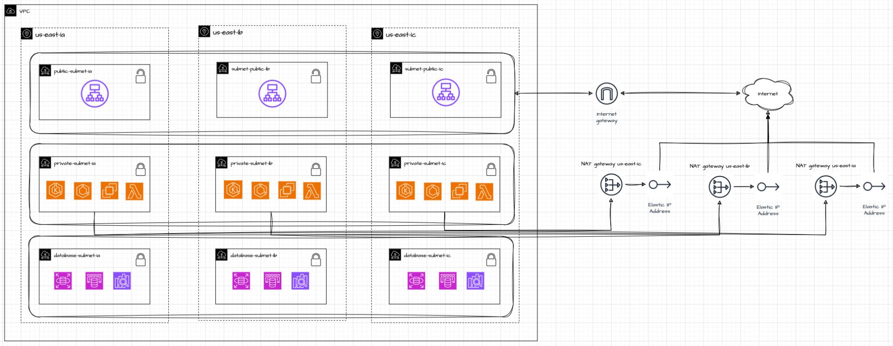
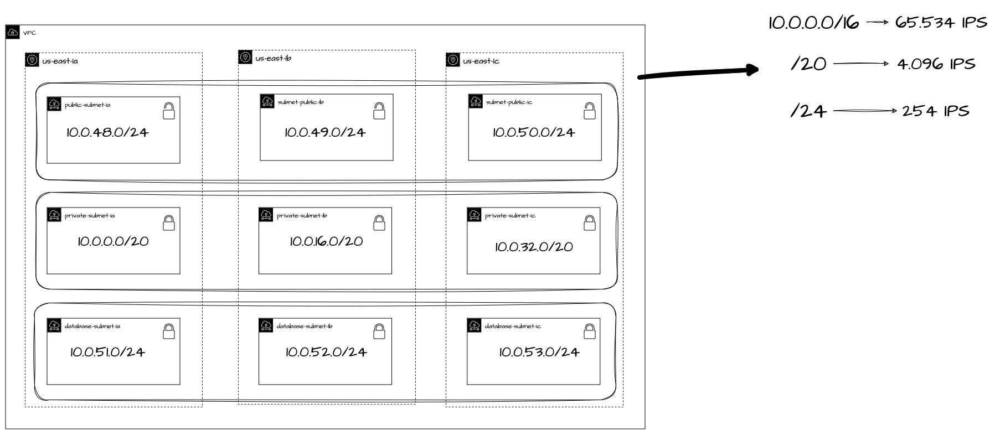

# linuxtips-course-containers-vpc


### Helpful commands
```sh
export AWS_DEFAULT_PROFILE=linuxtips

terraform init -backend-config=environment/dev/backend.tfvars
terraform fmt --recursive
terraform apply --auto-approve -var-file=environment/dev/terraform.tfvars
terraform apply -destroy

```

### Arch
 

### IPs distribution
 

